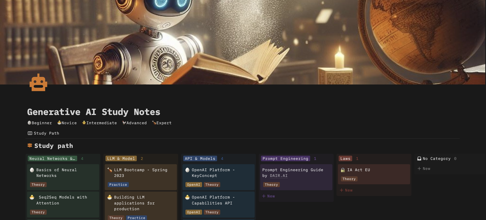

## Welcome to the Generative AI Study Notes Repository! 

This repository is a collection of educational materials gathered while studying generative artificial intelligence (AI). In a field that is always changing like generative AI, staying updated with key information is crucial for building skills, choosing competencies, sharing examples, and showing experimental results.

This repository is helpful for anyone who wants to learn, dive deeper, and effectively use generative AI technologies in a structured way. It covers a wide range of topics, from high-level concepts that are easy for beginners and quickly applicable, like prompting, to technical fundamentals like neural networking.

Whether you are a beginner or an experienced professional, this repository aims to provide valuable resources to support your study in the world of generative AI and to share your study materials with others

#  LLM Leaderboard ## 

🏆 [LMSYS Chatbot Arena Leaderboard](https://chat.lmsys.org/?leaderboard) is a crowdsourced open platform for LLM evals. They collected over 1,000,000 human pairwise comparisons to rank LLMs with the Bradley-Terry model and display the model ratings in Elo-scale. 

# Game-Changer
- [Meta’s Bizarre AI Infrastructure Choice Costs Them $100s of Millions](https://www.semianalysis.com/p/google-we-have-no-moat-and-neither?utm_campaign=Newsletter%2B%2352&utm_content=Newsletter%2B%2349&utm_medium=email_action&utm_source=customer.io) In March 2023, the open-source community gained access to Meta's LLaMA model, a powerful foundation model. Despite lacking advanced tuning and RLHF, its potential was quickly recognized, leading to rapid innovation. Within a month, significant advancements were made, including instruction tuning, quality improvements, and multimodality. Crucially, the scaling problem was solved, allowing individuals to experiment with the model using just a powerful laptop, dramatically lowering the barrier to entry for training and experimentation.

- [The Rise of the AI Engineer](https://www.latent.space?utm_source=navbar&utm_medium=web) There'll probably be way more AI Engineers than ML or LLM engineers. You can totally rock this job without needing any special training

# From high-level concepts... to technical fundamentals

[To get started, check out the Generative AI Glossary for key terms and concepts](doc/Generative%20AI%20Glossary.md) 

[To enhance your training, review this proposal on a training path available on Notion](https://festive-chestnut-92c.notion.site/Generative-AI-Study-Notes-0f6a0129164645c5a862e6eebb2e2986)

[To improve your coding skills, explore this proposal on Colab code](https://colab.research.google.com/drive/1BL0GA5FBBnYcx_WUUco6kgiDU7vtWQnC?usp=sharing)

## Prompt Engineering #
- [Prompt engineering guide](https://www.promptingguide.ai/)
- [Learn prompting](https://learnprompting.org/)
- [OpenAI prompt engineering](https://platform.openai.com/docs/guides/prompt-engineering/prompt-engineering)
- [Best practices for prompt engineering with the OpenAI API](https://help.openai.com/en/articles/6654000-best-practices-for-prompt-engineering-with-the-openai-api)
- [Anthropic prompt engineering](https://docs.anthropic.com/en/docs/build-with-claude/prompt-engineering/overview)
- [Awesome-Prompt-Engineering](https://github.com/promptslab/Awesome-Prompt-Engineering)
- [Prompt Engineering 201: Advanced methods and toolkits](https://amatria.in/blog/prompt201)

## API & Models ##
- [OpenAI API](https://openai.com/api/)
    - [How to count tokens](https://cookbook.openai.com/examples/how_to_count_tokens_with_tiktoken)
    - [How to make your completions outputs consistent with the new seed parameter](https://cookbook.openai.com/examples/reproducible_outputs_with_the_seed_parameter)
- [Anthropic Clade API](https://www.anthropic.com/api)
- [Mistral AI API](https://docs.mistral.ai/api/)
- [Cohere API](https://docs.cohere.com/)

## Neural Networks ##

1. [Visual Interactive Guide to Basics of Neural Networks](https://jalammar.github.io/visual-interactive-guide-basics-neural-networks/)

1. [Feedforward Neural Networks: A Visual Interactive Guide](https://jalammar.github.io/feedforward-neural-networks-visual-interactive/)

1. [Visualizing Neural Machine Translation Mechanics of Seq2Seq Models with Attention](https://jalammar.github.io/visualizing-neural-machine-translation-mechanics-of-seq2seq-models-with-attention/)

## Transformer ##

1. [The Illustrated Transformer](https://jalammar.github.io/illustrated-transformer/?utm_campaign=Commit+%2337&utm_content=Commit+%2337&utm_medium=email_action&utm_source=customer.io)
1. [Glossary of deep learning word embedding](https://medium.com/deeper-learning/glossary-of-deep-learning-word-embedding-f90c3cec34ca)
1. [wevi: word embedding visual inspector](https://ronxin.github.io/wevi/)
1. [Word Embedding Explained and Visualized - word2vec and wevi](https://www.youtube.com/watch?v=D-ekE-Wlcds)
1. [Google Colab Notebook: hello_t2t.ipynb](https://colab.research.google.com/github/tensorflow/tensor2tensor/blob/master/tensor2tensor/notebooks/hello_t2t.ipynb)

## LLM & Model ##
1. [LLM Bootcamp - Spring 2023](https://www.youtube.com/watch?v=twHxmU9OxDU&list=PL1T8fO7ArWleyIqOy37OVXsP4hFXymdOZ)

2. [Building LLM applications for production](https://huyenchip.com/2023/04/11/llm-engineering.html?utm_campaign=Commit+%2337&utm_content=Commit+%2337&utm_medium=email_action&utm_source=customer.io)
 
## Laws ##
- [WikiAiAct - il primo wiki italiano sull'Artificial Intelligence Act](https://www.wikiaiact.it/wiki/Pagina_principale)

# Developer resources #

- [AskFSDL](https://github.com/the-full-stack/ask-fsdl) create an AI app - askFSDL is a demonstration of a retrieval-augmented question-answering application
- [OpenAI tokenizer](https://platform.openai.com/tokenizer)
- [Google colab](https://colab.research.google.com/) Cloud-based platform for running Jupyter notebooks with access to powerful computing resources like GPUs. You can use Google Colab to develop your first MVP app.
- [Tiktoken](https://github.com/openai/tiktoken) is a fast BPE tokeniser for use with OpenAI's models. 

# Links #
- [DAIR.AI Democratizing Artificial Intelligence Research, Education, and Technologies](https://dair.ai/)
- [Microsoft Generative AI for Beginners](https://github.com/denismarini/generative-ai-for-beginners/tree/main)
- [Openai cookbook](https://cookbook.openai.com/)

# How to use and contribute #

This repository encourages contributions! Whether you have additional resources to share, suggestions for improvement, or feedback on existing content, you can participate by opening a pull request or creating an issue.

## Contact Information ##

For questions, suggestions, or collaborations, please feel free to contact us directly through GitHub or [Discord](https://discord.gg/wjXWRUHc)

## Attribution ##
This repository includes links to materials distributed under the [Creative Commons Attribution-NonCommercial-ShareAlike 4.0 International](https://creativecommons.org/licenses/by-nc-sa/4.0/) license.

- Articles written by Jay Alammar and published on [https://jalammar.github.io](https://jalammar.github.io) are available under the CC BY-NC-SA 4.0 license.

## Author 🚶 ##
* Denis Marini
