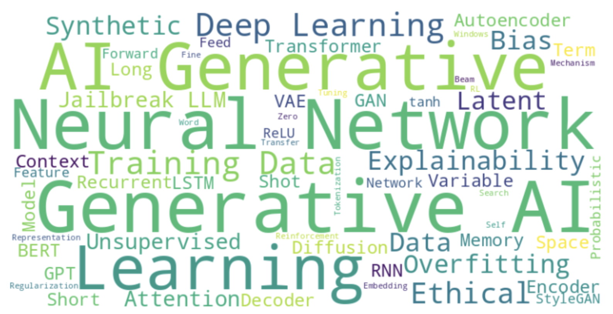

# Generative AI Glossary

## General Concepts

| **Termine**                 | **Definizione**                                                                                                                                                                                                 |
|------------------------------|---------------------------------------------------------------------------------------------------------------------------------------------------------------------------------------------------------------|
| **Generative AI**           | Un ramo dell'intelligenza artificiale focalizzato sulla generazione di nuovi contenuti, come testo, immagini, musica o altri dati, utilizzando algoritmi e modelli.                                             |
| **Neural Network**          | Un modello computazionale ispirato al cervello umano, costituito da strati di nodi interconnessi (neuroni) che elaborano i dati e apprendono schemi.                                                            |
| **Deep Learning**           | Una sottocategoria del machine learning che utilizza reti neurali con molti strati (reti profonde) per modellare pattern complessi in grandi dataset.                                                          |
| **Training Data**           | Il dataset utilizzato per addestrare un modello di machine learning, costituito da coppie input-output che guidano il processo di apprendimento.                                                                |
| **Ethical AI**              | La pratica di progettare e implementare sistemi di IA in modo equo, trasparente e allineato a principi etici per evitare danni e bias.                                                                          |
| **Explainability**          | La capacità di comprendere e interpretare le decisioni prese dai modelli di IA, fondamentale per la fiducia e la responsabilità nei sistemi di IA.                                                              |
| **Bias**                    | Errore sistematico introdotto da un modello che porta a risultati errati o ingiusti, spesso dovuti a squilibri nei dati di addestramento.                                                                      |
| **Overfitting**             | Un errore di modellazione che si verifica quando un modello di machine learning apprende il rumore e i dettagli nei dati di addestramento al punto da compromettere le sue prestazioni su nuovi dati.            |
| **Synthetic Data**          | Dati generati da un modello che imitano i dati del mondo reale, spesso utilizzati per aumentare i dataset di addestramento o per proteggere la privacy.                                                          |
| **Jailbreak (LLM)**         | Nel contesto di un Large Language Model (LLM), il jailbreak si riferisce al processo di eludere le restrizioni e le misure di sicurezza integrate implementate dagli sviluppatori del modello.                    |
| **Unsupervised Learning**   | Un tipo di machine learning in cui il modello apprende pattern dai dati non etichettati, senza supervisione esplicita o esempi etichettati.                                                                     |

## Models and Architectures

| **Termine**                 | **Definizione**                                                                                                                                                                                                 |
|------------------------------|---------------------------------------------------------------------------------------------------------------------------------------------------------------------------------------------------------------|
| **Transformer**             | Un tipo di architettura di rete neurale che utilizza meccanismi di auto-attenzione per elaborare i dati di input in parallelo, particolarmente efficace per compiti di elaborazione del linguaggio naturale.     |
| **GPT (Generative Pre-trained Transformer)** | Un modello linguistico generativo all'avanguardia sviluppato da OpenAI, capace di produrre testi simili a quelli umani basati su un prompt fornito.                                                   |
| **BERT (Bidirectional Encoder Representations from Transformers)** | Un modello basato su transformer progettato per comprendere il contesto delle parole in un testo considerando sia il contesto a sinistra che a destra in tutti i livelli.                             |
| **GAN (Generative Adversarial Network)** | Un tipo di modello generativo costituito da due reti neurali, un generatore e un discriminatore, che competono tra loro per produrre dati realistici.                                                   |
| **Autoencoder**             | Un tipo di rete neurale utilizzato per l'apprendimento non supervisionato che mira a apprendere rappresentazioni efficienti dei dati codificando i dati di input in uno spazio latente a dimensione inferiore e poi ricostruendoli. |
| **VAE (Variational Autoencoder)** | Un modello generativo che impara a codificare i dati di input in uno spazio latente probabilistico, dal quale possono essere generati nuovi dati tramite campionamento.                                   |
| **Latent Space**            | Uno spazio ad alta dimensione in cui i dati vengono codificati in una forma compressa, spesso utilizzato nei modelli generativi come autoencoders e GANs per rappresentare le caratteristiche dei dati di input. |
| **Latent Variable**         | Una variabile non osservata inferita dai dati osservati, utilizzata nei modelli generativi come VAE e GAN per rappresentare strutture sottostanti.                                                             |
| **Recurrent Neural Network (RNN)** | Un tipo di rete neurale progettata per gestire dati sequenziali mantenendo uno stato nascosto che cattura informazioni dai passaggi precedenti nella sequenza.                                            |
| **Long Short-Term Memory (LSTM)** | Un tipo di RNN progettato per catturare meglio le dipendenze a lungo raggio utilizzando meccanismi speciali di gating per controllare il flusso di informazioni.                                        |
| **StyleGAN**                | Una rete generativa avversaria nota per la sua capacità di generare immagini altamente realistiche con attributi controllabili manipolando lo spazio latente.                                                   |
| **Feed-Forward Network**    | Una rete neurale artificiale in cui le connessioni tra i nodi non formano cicli. L'informazione si muove in una sola direzione: dai nodi di input ai nodi di output, passando per eventuali nodi nascosti.        |
| **ReLU (Rectified Linear Unit)** | Una funzione di attivazione popolare utilizzata nelle reti neurali che restituisce zero per input negativi e l'input stesso per input positivi, promuovendo la sparità e alleviando il problema del gradiente che scompare. |
| **tanh (Hyperbolic Tangent)** | Una funzione di attivazione comunemente usata nelle reti neurali che schiaccia i valori di input nell'intervallo [-1, 1], rendendola efficace per output che vanno da -1 a 1.                                     |
| **Diffusion Model**         | Un tipo di modello generativo che impara a generare dati invertendo un processo di diffusione, spesso utilizzato per generare immagini di alta qualità.                                                        |
| **Diffusion Probabilistic Model** | Un tipo di modello generativo che formula la generazione dei dati come un processo di diffusione, denoising gradualmente un campione per generare dati realistici.                                   |
| **Encoder**                 | Un componente di una rete neurale, particolarmente nei modelli sequence-to-sequence, che elabora i dati di input e li converte in una rappresentazione contestuale o di caratteristiche a dimensione fissa.      |
| **Decoder**                 | Un componente di una rete neurale, particolarmente nei modelli sequence-to-sequence, che prende la rappresentazione contestuale prodotta dall'encoder e genera la sequenza di output.                         |
| **Context or Feature Representation** | Un vettore a dimensione fissa o un set di vettori prodotto dall'encoder in una rete neurale, riassumendo le informazioni importanti dai dati di input.                                                  |

## Techniques and Mechanisms

| **Termine**                 | **Definizione**                                                                                                                                                                                                 |
|------------------------------|---------------------------------------------------------------------------------------------------------------------------------------------------------------------------------------------------------------|
| **Attention Mechanism**     | Una tecnica utilizzata nelle reti neurali, soprattutto nei transformers, per concentrarsi dinamicamente su diverse parti della sequenza di input, migliorando le prestazioni del modello su compiti come traduzione e riassunto. |
| **Self-Attention**          | Un meccanismo nelle reti neurali, particolarmente nei modelli transformer, che consente a ciascun elemento della sequenza di input di prestare attenzione a tutti gli altri elementi, migliorando la comprensione e la generazione del modello.   |
| **Encoder-Decoder Attention** | Un meccanismo utilizzato nei modelli sequence-to-sequence in cui il decoder si concentra su diverse parti dell'output dell'encoder a ogni passo della generazione della sequenza di output.                     |
| **Word Embedding**          | Una rappresentazione delle parole in uno spazio vettoriale continuo in cui le parole con significati simili hanno rappresentazioni simili.                                                                        |
| **Tokenization**            | Il processo di conversione del testo in unità più piccole (token), come parole o sotto-parole, che possono essere elaborate da un modello di linguaggio.                                                         |
| **Context Windows**         | Una tecnica utilizzata in vari algoritmi di elaborazione del linguaggio naturale in cui viene considerata una porzione limitata del testo circostante (finestra di contesto) per analizzare e comprendere il significato di una parola o frase. |
| **Beam Search**             | Un algoritmo di ricerca utilizzato nei compiti di generazione di sequenze per trovare la sequenza di token più probabile esplorando simultaneamente più possibili sequenze.                                       |
| **Fine-Tuning**             | Il processo di ulteriore addestramento di un modello pre-addestrato su un dataset specifico per adattarlo a un compito o dominio particolare.                                                                   |
| **Regularization**          | Tecniche utilizzate per prevenire l'overfitting aggiungendo una penalità alla complessità del modello, assicurando che generalizzi meglio ai dati non visti.                                                     |

## Learning Paradigms

| **Termine**                 | **Definizione**                                                                                                                                                                                                 |
|------------------------------|---------------------------------------------------------------------------------------------------------------------------------------------------------------------------------------------------------------|
| **Reinforcement Learning (RL)** | Un tipo di machine learning in cui un agente impara a prendere decisioni interagendo con un ambiente e ricevendo feedback sotto forma di ricompense o penalità.                                               |
| **Zero-Shot Learning**       | La capacità di un modello di eseguire compiti o generare contenuti senza aver visto alcun esempio durante l'addestramento, basandosi sulla generalizzazione da compiti correlati.                                |
| **Few-Shot Learning**        | La capacità di un modello di apprendere nuovi compiti con pochissimi esempi di addestramento, dimostrando flessibilità e adattabilità.                                                                           |
| **Transfer Learning**        | Una tecnica di machine learning in cui un modello pre-addestrato viene adattato a un nuovo compito con dati limitati, sfruttando le conoscenze apprese dal compito originale.                                     |
